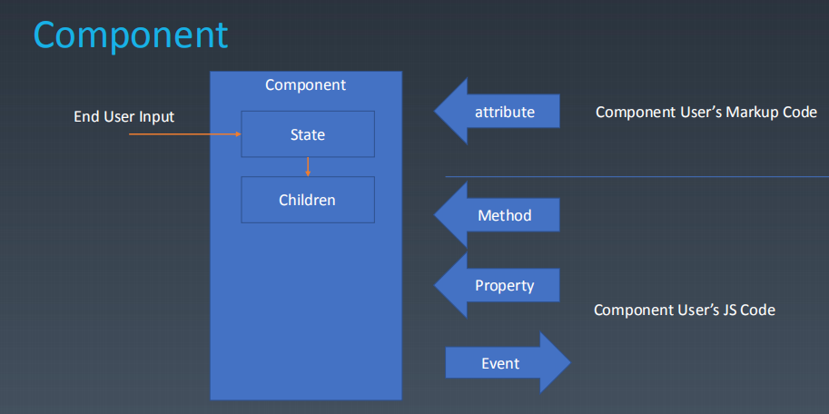
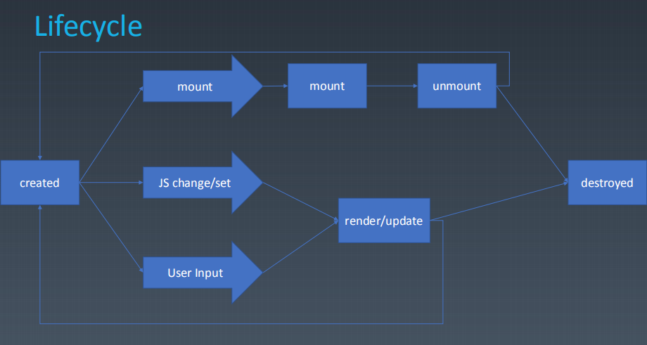

### jsx文件夹本周全部代码 
  `npm install`

  `npm start`

### 1. 组件的基本知识 | 组件的基本概念和基本组成部分

- 组件是特殊的对象，特殊的模块
- 对象
  - Properties 属性
  - Methods 方法
  - Inherit 继承关系
- 组件
  - Properties 属性 从属关系
  - Methods 方法
  - Inherit 继承关系
  - Attribute 属性 强调描述
  - Config & State 配置 & 转态
  - Event 组件向外传递
  - Lifecycle 声明周期
  - Children 树形结构的必要条件



- Attribute vs Property
  Attribute 强调描述性 Property 强调从属关系

  ```
    //Attribute:
    <my-component attribute=“v” />
    myComponent.getAttribute(“a”)
    myComponent.setAttribute(“a”,“value”);

    //Property:
    myComponent.a = “value”;
  ```

  ```
    <div class="cls1 cls2"></div>
    <script>
    var div = document.getElementByTagName(‘div’);
    div.className // cls1 cls2
    </script>
  ```

  ```
    <div class="cls1 cls2" style="color:blue" ></div>
    <script>
    var div = document.getElementByTagName('div');
    div.style // 对象
    </script>
  ```

  ```
    <a href="//m.taobao.com" ></div>
    <script>
    var a = document.getElementByTagName('a’);
    a.href // “http://m.taobao.com”，这个 URL 是 resolve 过的结果
    a.getAttribute(‘href’) // “//m.taobao.com”，跟 HTML 代码中完全一致
    </script>
  ```

  ```
    <input value = "cute" />
    <script>
    var input = document.getElementByTagName(‘input’); // 若 property 没有设置，
    则结果是 attribute
    input.value // cute
    input.getAttribute(‘value’); // cute
    input.value = ‘hello’; // 若 value 属性已经设置，则 attribute 不变，property 变化，
    元素上实际的效果是 property 优先
    input.value // hello
    input.getAttribute(‘value’); // cute
    </script>
  ```

- 设计组件状态
  | Markup set | JS set | JSChange | User Input Change |  change   |
  | :--------: | :----: | :------: | :---------------: | :-------: |
  |     ×      |   √    |    √     |        ？         | property  |
  |     √      |   √    |    √     |        ？         | attribute |
  |     ×      |   ×    |    ×     |         √         |   state   |
  |     ×      |   √    |    ×     |         ×         |  config   |

  - property 不能被静态的标签去设置 可以被 JS 设置 可以被 JS 改变 可以被用户改变但是不建议
  - attribute 能被静态的标签去设置 可以被 JS 设置 可以被 JS 改变 可以被用户改变但是不建议
  - state 不能被静态的标签去设置 不可被 JS 设置 不可被 JS 改变 可以被用户改变
  - config 不能被静态的标签去设置 可以被 JS 设置 不可被 JS 改变 不可以被用户改变

- 生命周期
  

- Children
  - Content 型 Children 与 Template 型 Children
  ```
    <my-button>{{title}}</my-button>
    <my-list>
    <li>{{title}}</li>
    </my-list>
  ```

### 2. 组件的基本知识 | 为组件添加 JSX 语法(环境搭建)(JSX 是 babel 的一个插件)

- 新建文件夹 进入终端查找文件夹
- npm init

  ```
    Press ^C at any time to quit.
    package name: (jsx)
    version: (1.0.0)
    description:
    entry point: (index.js)
    test command:
    git repository:
    keywords:
    author:
    license: (ISC)
    About to write to E:\2020GeekUniversityFrontend\PracticeEveryWeek\week12\JSX\package.json:

    {
      "name": "jsx",
      "version": "1.0.0",
      "description": "",
      "main": "index.js",
      "scripts": {
        "test": "echo \"Error: no test specified\" && exit 1"
      },
      "author": "",
      "license": "ISC"
    }


    Is this OK? (yes)
  ```

- npm install -g webpack webpack-cli (webpack --version 4.44.1)
- npm install --save-dev webpack babel-loader
- npm install --save-dev @babel/core @babel/preset-env
- npm install --save-dev @babel/plugin-transform-react-jsx

### 3. 组件的基本知识 | JSX 的基本使用方法

### 4. 轮播组件 | 轮播组件（一）

- 安装 `npm install webpack-dev-server --save-dev`
- 安装 `npm install --save-dev webpack-cli`
- 运行 `webpack-dev-server`
- 
webpack.config.js文件内容
```
module.exports = {
  entry: './main.js',
  devServer: {
    contentBase: './dist',
  },
  module: {
    rules: [
      {
        test: /\.js$/,
        use: {
          loader: "babel-loader",
          options: {
            presets: ["@babel/preset-env"],
            plugins: [["@babel/plugin-transform-react-jsx", { pragma: "createElement" }]]
          }
        }
      }
    ]
  },
  mode: "development"
};
```

### 5. 轮播组件 | 轮播组件（二）
* classList
* background-size
* transition
* transform

### 6. 轮播组件 | 轮播组件（三）

`MouseEvent` 接口指用户与指针设备( 如鼠标 )交互时发生的事件。使用此接口的常见事件包括：click，`dblclick`，`mouseup`，`mousedown`。

* `offsetX`、`offsetY`
鼠标指针相对于目标节点内边位置的X坐标
鼠标指针相对于目标节点内边位置的Y坐标

* `clientX`、`clientY`
鼠标指针在元素（DOM）中的X坐标。
鼠标指针在点击元素（DOM）中的Y坐标。

* `screenX` `screenY `
鼠标指针相对于全局（屏幕）的X坐标；
鼠标指针相对于全局（屏幕）的Y坐标；

*`pageX` `pageY`
`pageX` 是一个由`MouseEvent`接口返回的相对于整个文档的x（水平）坐标以像素为单位的只读属性。
`pageY`是一个只读属性，它返回触发事件的位置相对于整个 document 的 Y 坐标值。由于其参考物是整个 dom，所以这个值受页面垂直方向的滚动影响。

* `x`、`y`
`clientX`的别名。
`clientY`的别名。

### 7. 轮播组件 | 轮播组件（四）
`Math.sign()` 函数返回一个数字的符号, 指示数字是正数，负数还是零。

此函数共有5种返回值, 分别是 1, -1, 0, -0, NaN. 代表的各是正数, 负数, 正零, 负零, NaN。

```
Math.sign(3);     //  1
Math.sign(-3);    // -1
Math.sign("-3");  // -1
Math.sign(0);     //  0
Math.sign(-0);    // -0
Math.sign(NaN);   // NaN
Math.sign("foo"); // NaN
Math.sign();      // NaN
```


###

